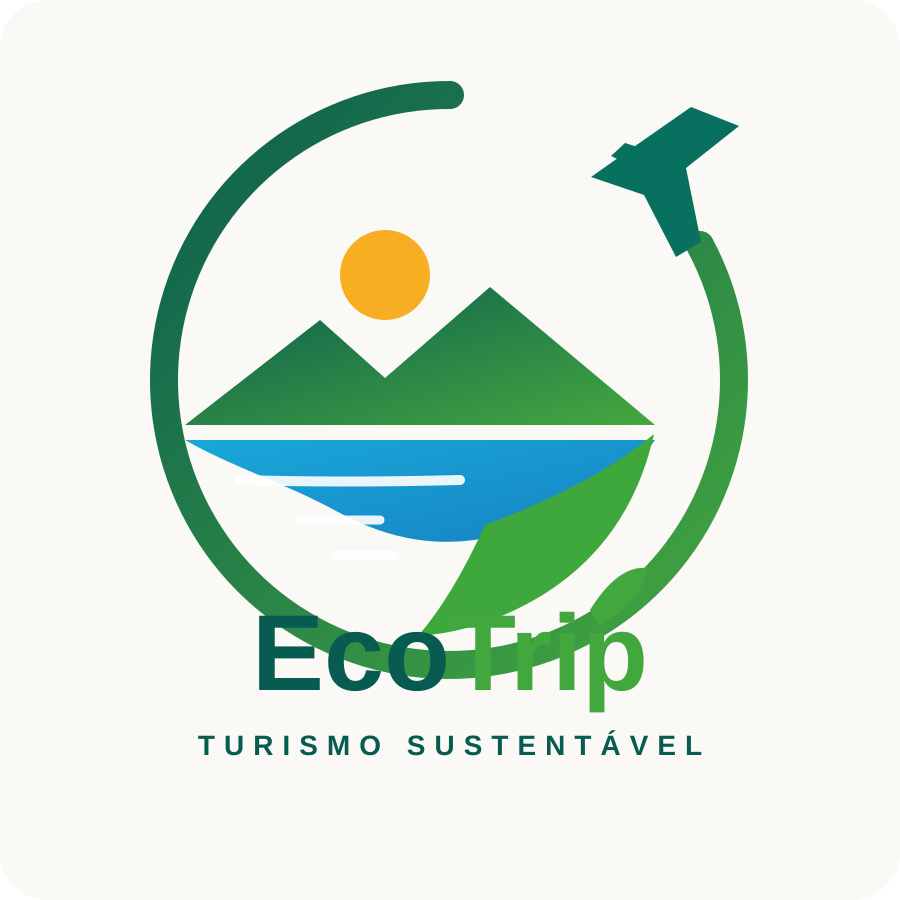

# 🌱 EcoTrip — Turismo Sustentável

<p align="center">
  
</p>

<p align="center"><strong>Projeto Integrador — Desenvolvimento Front-end para Web</strong></p>

Projeto acadêmico desenvolvido na disciplina de **Desenvolvimento Front-end para Web**, com o tema **EcoTrip — Turismo Sustentável**.

A proposta foi construída progressivamente ao longo das aulas, mantendo cada atividade separada para preservar a evolução do projeto, facilitar a avaliação e demonstrar a aplicação prática dos conteúdos estudados.

## 📚 Atividades

### 01 — Fundamentos do Desenvolvimento Web
Definição do tema, organização inicial do projeto, Git/GitHub, README, `.gitignore` e `index.html` inicial.

### 02 — Estrutura HTML5 e Conceitos Web
Estrutura HTML5, metadados, títulos, parágrafos, listas, tabela, link externo, imagem com `alt` e organização de pastas.

### 03 — HTML5 Semântico e Formulários
Estrutura semântica, hierarquia de headings, formulário temático, validação nativa, `fieldset`, `legend`, labels e práticas de acessibilidade.

### 04 — HTML5 Multimídia
Vídeo em MP4 e WebM, fallback de formatos, poster, legendas WebVTT, `preload` justificado e verificação de suporte com `canPlayType()`.

### 05 — HTML5 Canvas e SVG
Recursos gráficos aplicados ao EcoTrip: SVG vetorial com `viewBox`, identificação acessível e elementos gráficos persistentes; Canvas com gráfico de indicadores, `clearRect()`, `requestAnimationFrame()` e conteúdo alternativo para acessibilidade.

## 🎨 Identidade visual

A identidade do EcoTrip representa a união entre **viagem e sustentabilidade**, utilizando elementos visuais como natureza, água, montanhas, folha, sol e avião.

A logo foi disponibilizada em **SVG**, mantendo qualidade vetorial e permitindo sua utilização tanto na documentação quanto na interface do projeto.

## 📁 Estrutura do projeto

```text
projeto_integrador_front-end/
├── assets/
│   └── logo-ecotrip.svg
├── Atividade 01 — Fundamentos do Desenvolvimento Web/
├── Atividade 02 — Estrutura HTML5 e Conceitos Web/
├── Atividade 03 — HTML5 Semântico e Formulários/
├── Atividade 04 — HTML5 Multimídia/
├── Atividade 05 — HTML5 Canvas e SVG/
├── README.md
└── .gitignore
```

Cada atividade possui seus próprios arquivos, mantendo a evolução do projeto independente e permitindo visualizar claramente o conteúdo desenvolvido em cada aula.

## 🌱 Sobre o EcoTrip

O **EcoTrip** é um projeto acadêmico de turismo sustentável voltado à apresentação de destinos, experiências e escolhas mais conscientes durante uma viagem.

Ao longo das atividades, o projeto evoluiu de uma estrutura HTML inicial para uma aplicação demonstrativa que reúne:

- 🌿 Estrutura e organização de páginas web;
- ♿ Semântica e acessibilidade;
- 📝 Formulários e validação nativa;
- 🎬 Recursos multimídia;
- 🎨 Gráficos vetoriais com SVG;
- 📊 Gráficos desenhados com Canvas;
- ✨ Animações com `requestAnimationFrame()`;
- 🔀 Versionamento e organização com Git/GitHub.

## 🧠 Evolução técnica

| Atividade | Principal aprendizado |
|---|---|
| 01 | Git, GitHub e organização do projeto |
| 02 | Estrutura e elementos fundamentais do HTML5 |
| 03 | Semântica, formulários e acessibilidade |
| 04 | Vídeo, fontes alternativas, poster e legendas |
| 05 | Canvas, SVG, paradigmas gráficos e animação |

## 🛠️ Tecnologias

- HTML5
- CSS3
- JavaScript
- SVG
- Canvas API
- Git
- GitHub

## 🚀 Objetivo

Construir uma base sólida em **desenvolvimento Front-end para Web**, aplicando progressivamente os conceitos apresentados em aula e mantendo um histórico organizado e profissional no GitHub.

---

<p align="center"><strong>EcoTrip — Viaje com propósito. 🌱✈️</strong></p>
